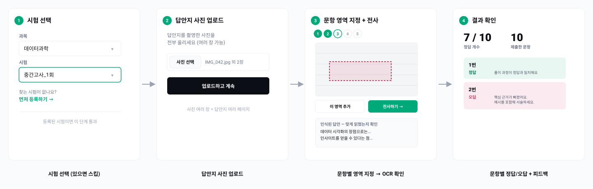

# hackertoni — 시험지 OCR 채점 서비스

학생이 자신이 푼 시험지 사진을 올리면 OCR로 문항별 풀이를 정리하고, DB에 등록된 시험지/정답지와 대조해 LLM으로 채점·첨삭해주는 서비스. 선생님/학생 역할 구분 없이 학생 혼자 처음부터 끝까지 진행하는 것을 기준으로 설계함 (시험이 아직 없으면 본인이 등록까지 함).

## 플로우



전부 `grading.html` 하나의 화면 안에서 이어지는 단계형(스텝퍼) 흐름이다:

1. **시험 선택** — 과목/시험을 골라 시작. DB에 이미 등록돼 있으면 바로 2단계로. 찾는 시험이 없으면 "먼저 등록하기"로 `exam_adding.html`(과목명+시험명+총 문제 수+시험지/정답지 PDF 업로드 → 페이지별로 분리 → 문항마다 페이지를 넘기며 드래그로 영역 지정·크롭 → 확정 시 MinerU OCR로 `question_text`/`answer_text` 저장)을 먼저 거친 뒤, 확정과 동시에 방금 등록한 시험으로 그대로 2단계로 넘어감
2. **답안 제출** — 시험지 등록과 동일한 패턴(전체 업로드 → 문항별 크롭)을 학생 답안에도 적용:
   - 답안지를 촬영한 사진을 한 번에 여러 장 업로드
   - 문제마다 사진을 넘겨가며 드래그로 답 영역을 지정 (여러 곳에 걸쳐 있으면 "이 영역 추가"로 이어붙이기 가능, 사진 한 장이 통째로 한 문제 답이면 "이 사진 전체 사용")
   - "전사하기"를 누르면 그 문항만 OCR 실행 → 인식된 텍스트를 바로 보여줘서 맞게 읽혔는지 확인시킨 뒤("영역 다시 지정" 가능) 다음 문항으로
3. **결과 확인** — 모든 문항 처리 후 채점 요청 → DB에 저장된 정답 원문과 학생 풀이를 LLM에 보내 문항별로 정답 여부(`is_correct`)와 피드백(`feedback`)을 생성, 정답/오답 개수 요약과 함께 표시

`answer_adding.html`(문항 정답 수동 정정 화면)은 이 학생 단일 플로우에는 포함되지 않음 — 필요하면 URL로 직접 접근.

## 아키텍처

```
app/
  main.py           FastAPI 엔드포인트
  src/
    db.py           SQLAlchemy 모델 (Subject / Exam / Question), SQLite(exam.db)에 영구 저장
    storage.py       업로드 원본·페이지·문항 크롭 이미지 저장 (미리보기 시 임시 위치 → 확정 시 data/exams/<id>/로 이동)
    preprocess.py    사진 입력 자동 기울어짐 보정 (OpenCV)
    ocr.py           MinerU CLI 래퍼 (PDF/이미지 → markdown 텍스트)
    llm.py           Gemini API 호출 (채점 판정 is_correct / 첨삭 feedback, 문항당 각각 1회씩 호출)
    matching.py      학생 답안-DB 정답 매칭 (순수 로직)
  static/            프론트엔드 (index / exam_adding / grading / answer_adding), 프레임워크 없이 vanilla JS
    style.css        공통 디자인 토큰(포인트 컬러 1개 + 절제된 팔레트) — 세 화면이 같은 스타일 공유
    common.js        fetch 헬퍼, 상태 표시, 커스텀 파일 업로드 버튼 등 공통 UI 로직
```

- DB: SQLite 파일(`exam.db`)로 서버 재시작해도 영구 보존. `Question`은 문항 본문(`question_text`)과 모범답안 원문(`answer_text`) 딱 두 텍스트 필드만 가짐 — 정답/해설을 등록 시점에 미리 구조화하지 않고, 채점 시점에 LLM이 원문을 보고 직접 판단
- 원본 파일(시험지/정답지 PDF, 학생 답안 사진, 페이지 이미지, 문항별 크롭 이미지)은 시험은 `data/exams/<exam_id>/`, 진행 중인 업로드(아직 확정 전인 시험 등록·학생 답안 크롭)는 `data/_pending/<id>/` 아래에 저장, 경로만 DB에 기록
- 크롭은 시험 등록(`/exams/crop`)과 학생 답안 제출(`/submit/crop`) 양쪽 다 같은 구조: `page_index`(어느 페이지/사진에서 잘랐는지)와 `number`(몇 번 문항인지)가 분리되어 있어 한 페이지에 여러 문항이 있어도 각각 크롭 가능. 같은 문항에 크롭을 여러 번 하면 덮어쓰지 않고 세로로 이어붙임(발문/문제 분리, 답이 여러 곳에 걸친 경우 대응)
- OCR은 [MinerU](https://github.com/opendatalab/mineru)를 서브프로세스로 호출. 문항 인식(어디부터 어디까지가 한 문항인지)은 OCR/LLM이 아니라 사람이 크롭으로 직접 지정
- LLM은 Gemini API를 OpenAI 호환 엔드포인트로 호출 (`openai` SDK 그대로 사용, `base_url`만 Gemini로 지정). 채점 1문항당 정답 판정 1회 + 첨삭 1회, 총 2회 호출

## 기술 스택

- Python 3.11+, FastAPI, SQLAlchemy(SQLite)
- MinerU (OCR), OpenCV (deskew)
- Gemini API (LLM, OpenAI SDK 호환 엔드포인트로 호출)
- 프론트엔드: 순수 HTML + vanilla JS (프레임워크 없음)

## 설치

프로젝트 전용 conda 환경 `ocrenv`를 사용한다.

```bash
conda create -n ocrenv python=3.11
conda activate ocrenv
pip install -r requirements.txt
```

MinerU 모델 가중치는 최초 1회 별도로 받아야 한다 (수백MB~2GB, Mac은 GPU가 없으므로 가벼운 pipeline 백엔드용만 받으면 충분):

```bash
mineru-models-download -m pipeline
```

## 환경변수

| 변수 | 설명 |
|---|---|
| `GEMINI_API_KEY` | `/grade`(채점 판정·첨삭)에 사용. 시험 등록·크롭·전사(OCR)는 이 키 없이도 동작 |
| `GRADING_MODEL` | 선택. 기본값 `gemini-flash-latest` (현재 세대 Flash 모델로 자동 연결되는 별칭) |

## 실행

```bash
uvicorn app.main:app --reload
```

`http://127.0.0.1:8000/` 접속하면 프론트엔드 진입점이 뜬다.

## API

| Method | Path | 설명 |
|---|---|---|
| GET | `/subjects` | 과목 목록 |
| GET | `/subjects/{subject_id}/exams` | 과목별 시험 목록 (`num_questions` 포함) |
| POST | `/exams/save` | 시험지+정답지 PDF 업로드 → 페이지별 이미지로 분리, `preview_id`/페이지 수 반환 (DB 미반영) |
| GET | `/exams/preview/{preview_id}/pages/{field}/{page_index}` | 업로드된 시험지(`exam`)/정답지(`answer`)의 특정 페이지 이미지 서빙 (크롭 UI용) |
| POST | `/exams/crop` | 페이지 `page_index`에서 문항 `number`의 영역(x,y,w,h)을 잘라 저장. 같은 문항에 여러 번 호출하면 이어붙임 |
| POST | `/exams/confirm` | 크롭된 문항 이미지들을 OCR해서 DB에 확정 저장 |
| PUT | `/exams/{exam_id}/questions/{number}` | 특정 문항 모범답안(`answer_text`) 수동 입력·수정 |
| POST | `/submit/pages` | 학생 답안지 사진(여러 장 가능) 업로드, `submission_id`/사진 수 반환 (DB 미반영) |
| GET | `/submit/{submission_id}/pages/{page_index}` | 업로드된 답안지 사진 서빙 (크롭 UI용) |
| POST | `/submit/crop` | 사진 `page_index`에서 문항 `number`의 답 영역(x,y,w,h)을 잘라 저장. 같은 문항에 여러 번 호출하면 이어붙임 |
| POST | `/transcribe` | `submission_id`+문항 번호로 저장된 크롭 이미지 1개를 OCR (DB 무관, 문항 하나씩 처리) |
| POST | `/grade` | 전사된 문항 답안 배열 + `exam_id`로 채점(`is_correct`)·첨삭(`feedback`) |

## 테스트

프레임워크 없이 assert 기반 스크립트로 순수 로직만 검증한다 (LLM/OCR 호출 없이 실행 가능).

```bash
python test_preprocess.py
```

`test_matching.py`는 `matching.py`가 리팩터링되면서 (`merge_by_number` 제거, `pair_questions`의 참조 형식이 `dict[str, dict]` → `dict[str, str]`로 변경) 깨진 상태다 — 실행하면 import 단계에서 실패한다. 현재 스키마 기준으로 다시 작성 필요.

## 알려진 제한사항

- `answer_adding.html`(문항 정답 수동 입력 화면)은 아직 예전 스키마(`correct_answer` + `explanation` 2필드) 기준으로 되어 있어, 지금 백엔드(`answer_text` 1필드)와 폼 필드명이 안 맞음 — 이 화면으로 정답을 고쳐도 반영되지 않는다. 업데이트 필요
- 문항 크롭을 잘못 지정했을 때 초기화(완전히 새로 시작)하는 기능이 없음 — 계속 이어붙이기만 가능 (시험 등록 `/exams/crop`, 학생 답안 `/submit/crop` 둘 다 동일)
- `GEMINI_API_KEY`가 없으면 `/grade` 호출 시 에러 (등록·전사는 영향 없음)
- LLM 레이트리밋(429)은 분당 한도처럼 잠깐 기다리면 풀리는 경우엔 Gemini가 알려주는 대기시간만큼 기다렸다가 최대 5회 재시도함(`llm.py`의 `_chat_json`). 반면 일일 한도(quotaId에 `PerDay` 포함)는 기다려도 안 풀리므로 재시도 없이 바로 실패 처리 — `/grade`는 이 경우 500 스택트레이스 대신 429 + 안내 메시지를 반환함. 그 외 호출 실패(타임아웃 등)에는 재시도 로직 없음
- 채점은 문항마다 LLM을 2회씩(정답 판정 + 첨삭) 호출하는 구조라(배치 호출 아님), 문항 수가 많으면 지연시간·비용이 늘어남. Gemini 무료 티어는 분당·일일 요청 수 모두 낮아(예: 모델당 분당 5회, 일일 20회) 문항이 몇 개만 돼도 한도를 넘기기 쉬움
- `/exams/confirm`과 `/transcribe`는 MinerU OCR을 요청 처리 중에 동기적으로 실행하므로, 문항 수/사진 크기에 따라 응답이 느릴 수 있음
- deskew는 컨투어 기반 자동 보정이라 배경이 복잡하거나 종이 경계가 흐리면 실패할 수 있음 (실패 시 원본 그대로 사용)
