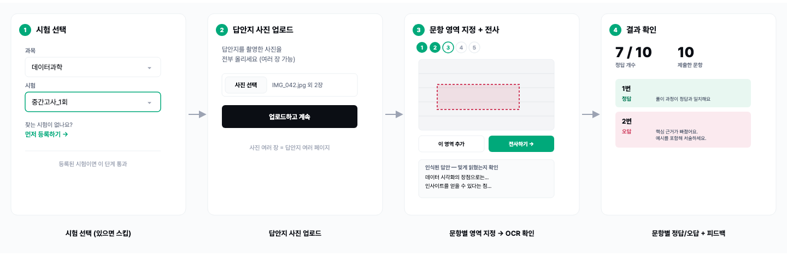
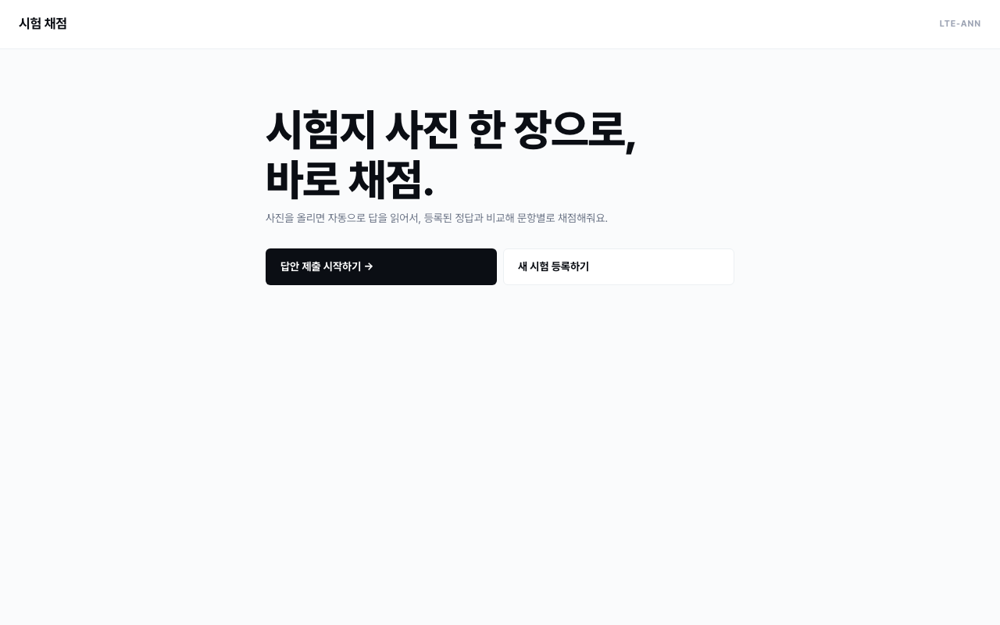
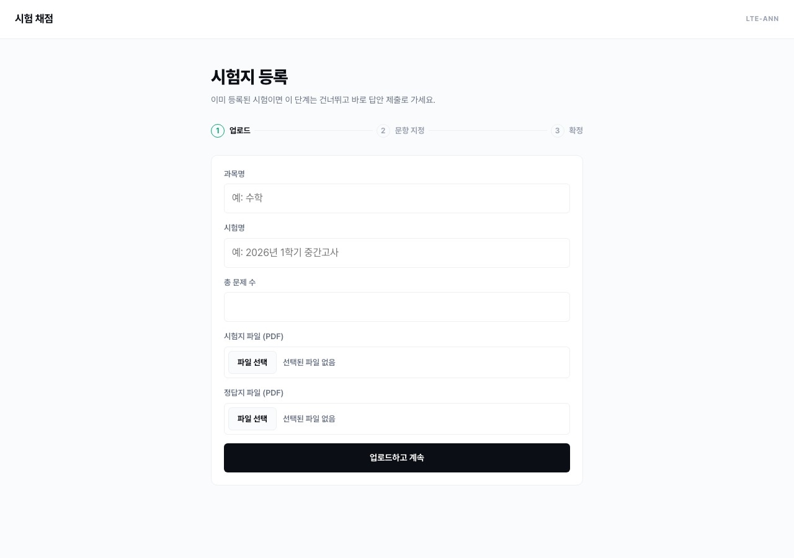
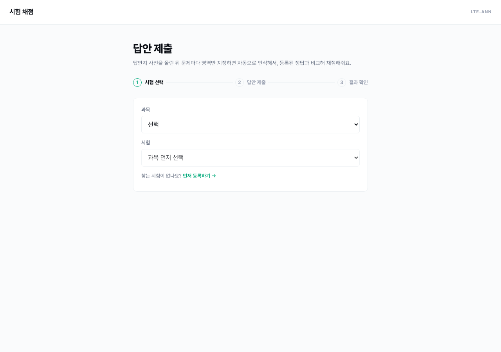
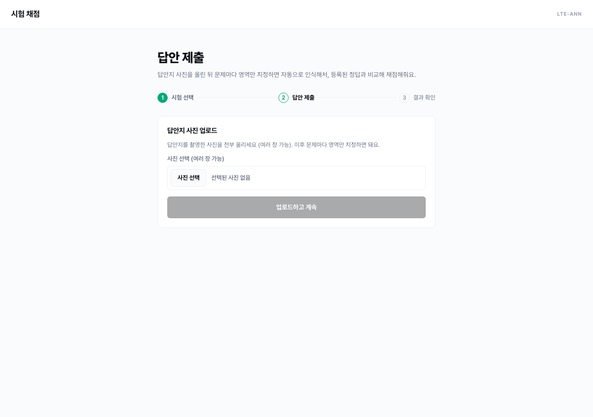

# 한국어 & 수식 특화 OCR을 통한 채점 서비스 자동화 프로그램 (시험지 OCR 자동 채점 서비스)

## 1. 탐구 동기 및 목적

저희가 앞서 진행한 데이터과학 모의고사 관련 활동 중, 특히 모의고사의 해설과 첨삭에 대한 반응이 좋았습니다. 후기에서 모의고사의 첨삭이 친절해서 오개념을 바로잡기 좋았다는 말이 많았습니다. 그래서 이런 도움을 비단 저희 모의고사가 아니라, 일반적인 기출고사나 타 모의고사에도 적용하고 싶었습니다.

그래서 문제지, 정답지, 학생의 답을 넣으면 채점을 해주며 필요한 부분에 대한 첨삭을 해주는 서비스를 제공하고자 하였습니다. 이를 위해 사진으로 주어지는 답지나 문제지를 텍스트로 변환하는 OCR 기능을 중점적으로 개발하였습니다.

## 2. 준비와 설계

앞서 제시하였듯이, 사용자가 이미지로 입력하는 데이터를 파싱하고 텍스트로 변환하여 저장하고, LLM을 통해서 평가 및 채점을 진행하는 서비스를 진행하고자 하였습니다. 전부 LLM을 이용하는 방법도 있지만, 이 과정에서 과도한 시간 등의 자원이 소모되리라 생각하여 OCR을 별도 모델을 이용하여 진행하고자 하였습니다. 

또한 구체적인 서비스 UX 플로우는 아래와 같이 3단계 흐름으로 설계하였습니다:

① **시험 선택**, ② **답안 제출**, ③ **결과 확인**

구체적으로 시험 선택 단계에서는 사전 데이터베이스에 추가된 시험을 가져오거나, 직접 시험지와 모범답안을 올려 데이터를 추가할 수 있도록 합니다. 답안 제출에서는 같은 방법으로 학생 본인의 답을 업로드하고, OCR을 통해 자동으로 텍스트로 전사합니다. 이후 결과 확인을 통해 채점 결과나 첨삭을 확인할 수 있도록 합니다. 구체적으로 시험지, 모범답안, 답을 인식하는 과정은 각 페이지를 사진으로 찍어 올린 후 문항별 내용을 crop하여 데이터베이스에 올리고자 합니다.

구체적인 플로우는 아래와 같습니다. 아래 사진은 실제 UI를 캡쳐한 내용입니다.

## 3. 탐구 과정

기술적으로 데이터베이스 관리, OCR 방법, OCR&LLM&DB 처리를 동시에 진행하기 위한 객체를 잘 정의하는 것이었습니다.

데이터베이스의 정리의 경우에는 sqlalchemy를 이용해서 웹에서 작동하는 과정 중에서도 지속적으로 업데이트 및 관리가 되도록 하였으며, OCR의 경우에는 GOT-OCRv2, MinerU, Corepin 등 다양한 모델에 대해 각각을 한국어 & 수식 데이터로 파인튜닝하면서 성능을 비교해보았습니다. 그 결과 MinerU 모델을 API 형태로 호출하며 사용하기로 결정하였습니다. LLM의 경우에는 Gemini Flash 모델을 API 형태로 호출하여 사용하였습니다.

이후 해당 내용을 잘 연결하기 위해 각 부분에서 필요하거나 제공하는 정보를 정리하고, 공통된 고유정보를 이용하여 각각의 객체를 연결할 방법을 찾았습니다. 또한 필요한 정보 사이 연결관계를 도식화하여 전체 프로그램이 잘 유기적으로 작동하도록 하였습니다. 이 과정을 프론트엔드 개발과 함께 진행하여 풀스택으로 개발하면서 특히 신경써야 할 점이 많았습니다.

## 4. 시연 및 결과

| 메인 화면 | 시험지 등록 |
|---|---|
|  |  |

| 답안 제출 — 시험 선택 | 답안 제출 — 사진 업로드 |
|---|---|
|  |  |

메인 화면은 등록된 시험이 있으면 곧바로 답안 제출로, 없으면 새 시험 등록으로 들어가는 두 경로만 제공하도록 하였습니다. 시험지 등록에서는 과목명·시험명·총 문제 수를 입력하고 시험지·정답지 파일을 올리면 페이지별로 분리되어, 다음 단계에서 문항마다 영역을 지정할 수 있도록 하였습니다. 답안 제출은 등록해 둔 과목과 시험을 고르면 곧바로 사진 업로드 단계로 넘어가고, 문항마다 인식 결과를 즉시 확인하며 다음 문항으로 진행하도록 하였습니다. 이를 통해 시험 등록부터 답안 제출, 채점 결과 확인까지 전체 흐름이 실제로 끝까지 동작하는 것을 확인하였습니다.

## 5. 한계와 향후 과제

다만 현재 사용 과정에서 일부 불편함이 남아있는 상황입니다. MinerU의 OCR이 정확하지 않아 사용자가 약간 수정해야하는 상황도 있을 뿐더러, 각 문항별 내용을 박스로 처리하는 과정도 여간 귀찮은게 아니었습니다.
그래서 이런 과정을 자동화하고자, OCR한 결과를 context를 고려하여 약간의 보정을 해주며, 이미지가 주어졌을 때 각 문항별 영역을 제시하는 모델을 덧붙이는 등의 방향으로 개선해 나가고자 합니다.
